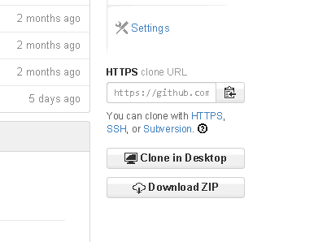
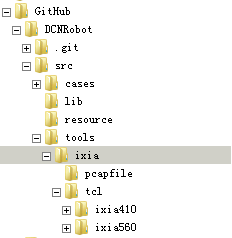

# DCNRobot

## 1. 简介
采用Robot测试框架，实现了对通信设备（如交换机，AC，AP等）的测试，其中的测试例及大部分关键字针对DCN设备，测试仪采用ixia及基于scapy的发包程序

## 2. [License](./LICENSE.txt)

## 3. [CopyRight](./COPYRIGHT.txt)

## 4. [Author](./AUTHORS.txt)

## 5. [安装](https://github.com/mytliulei/DCNRobotInstallPackages/blob/master/README.md)

  安装程序分为windows和linux

  1. windows

    * 建议win7系统，xp系统需要安装ipv6组件，即在cmd里执行ipv6 install
    * 登陆 ftp://10.1.145.36/RobotFramework/安装包/win32.rar ，解压后点击setup.bat安装（使用管理员权限）， **解压路径和程序安装路径不要有中文**
    * https://github.com/mytliulei/DCNRobotInstallPackages ，下载到本地，进入DCNRobotInstallPackages/windows/win32/ 执行setp.bat

  2. linux

    * *计划后续发布docker img...* :muscle:
    
## 6. 脚本下载

   * https://github.com/mytliulei/DCNRobot ，右下角Download ZIP ，点击下载，解压
   
   * 或者访问github，下载ftp://10.1.145.36/RobotFramework/脚本/DCNRobot.zip ，解压

## 7. 构建ixia运行环境
   
   测试仪需要ixia的，需构建ixia运行环境
   * 下载 ftp://10.1.145.36/RobotFramework/ixia运行环境/ixia.rar ， 解压到脚本DCNRobot\src\tools目录下，**注意解压后的目录结构为:**
   

   * 或者下载https://github.com/mytliulei/IxTclHal ，将ixia目录解压到脚本DCNRobot\src\tools目录下，目录结构同上
   
   
   

